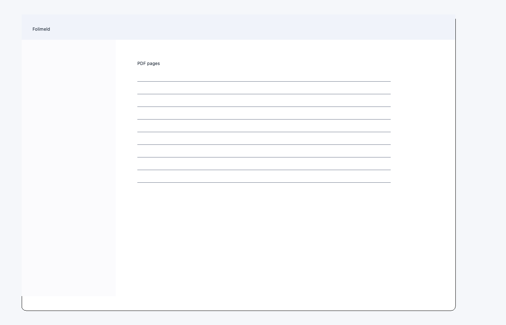

# Folimeld

Folimeld は、PDF のページを見ながら並べ替え、回転、挿入、削除できるデスクトップアプリです。Windows、macOS、Ubuntu に対応し、編集するファイルを外部サービスへ送信せず、ローカル環境で処理します。

## 特長

- サムネイルを見ながらPDFページを並べ替え
- 複数ページをまとめて選択・移動・回転・削除
- 別のPDFや、同じサイズの空白ページを挿入
- PDFバージョン、ページレイアウト、綴じ方向を編集
- 閲覧パスワードの設定と解除
- 日本語、英語、ドイツ語、スペイン語、フランス語、韓国語、ポルトガル語、中国語に対応
- Windows、macOS、Ubuntuで利用可能

## ダウンロード

配布パッケージは [GitHub Releases](https://github.com/tyamada/Folimeld/releases) からダウンロードできます。

| OS | 配布形式 |
| --- | --- |
| Windows 10 / 11 | EXE / MSIX（Microsoft Storeでの公開を準備中） |
| macOS | `.app` |
| Ubuntu 22.04以降 | `.deb` / 単体実行ファイル |

> [!NOTE]
> リリースによっては、一部のOS向けパッケージが用意されていない場合があります。

## 基本的な使い方

1. Folimeldを起動し、「ファイル」→「開く」からPDFを選択します。
2. ページをクリックして選択します。複数選択には Ctrl または Shift を使用します。
3. ツールバー、メニュー、またはドラッグ操作でページを編集します。
4. 「保存」または「名前を付けて保存」でPDFを書き出します。

パスワード付きPDFを開くと、閲覧パスワードの入力画面が表示されます。

### 文書設定

「文書のプロパティ」の「詳細」タブでは、PDFバージョンとページレイアウトを変更できます。`TwoPageLeft` または `TwoPageRight` を選択した場合、必要に応じてPDFバージョンが1.5へ引き上げられます。

### 設定の保存

表示言語と最後に開いたフォルダーは端末内に保存されます。Folimeld自体はPDFや個人情報をネットワークへ送信しません。

## 開発・コントリビューション

ソースからの実行、テスト、各OS向けパッケージの作成方法は [DEVELOPMENT.md](DEVELOPMENT.md) を参照してください。不具合報告や提案は [Issues](https://github.com/tyamada/Folimeld/issues) で受け付けています。

変更履歴は [CHANGELOG.md](CHANGELOG.md) にまとめています。

## ライセンス

Folimeld は [GNU Affero General Public License v3.0](LICENSE) で公開されています。

PySide6、PyMuPDFなどの第三者ライブラリには、それぞれのライセンスが適用されます。
